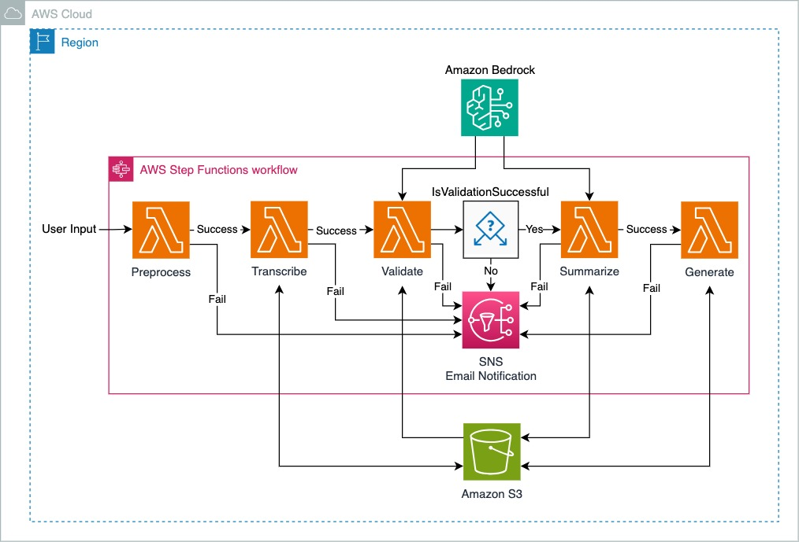

# Knowledge Capture using GenerativeAI

This proof-of-concept solution explains a potential solution that can be used to capture the tribal knowledge through voice recordings from senior employess of a company. It outlines methodologies, to use Amazon Transcribe and Amazon Bedrock service for the systematic documentation and verification of the input data. By providing a structure for the formalization of this informal knowledge, the solution guarantees its longevity and applicability to subsequent cohorts of employees in an organization. This endeavor not only ensures the sustained maintenance of operational excellence but also improves the effectiveness of training programs through the incorporation of practical knowledge acquired through direct experience.

## Table of Contents

- [Knowledge Capture using GenerativeAI](#knowledge-capture-using-generativeai)
  - [Table of Contents](#table-of-contents)
  - [Introduction](#introduction)
  - [Prerequisites](#prerequisites)
  - [Target technology stack](#target-technology-stack)
  - [Solution Architecture](#solution-architecture)
  - [Deployment](#deployment)
  - [Useful CDK commands](#useful-cdk-commands)
  - [High-level Code Structure](#high-level-code-structure)
  - [Personalizing the DocGen Application with Custom Data](#personalizing-the-docgen-application-with-custom-data)
  - [Subscribe to the Amazon SNS topic for failure notification](#subscribe-to-the-amazon-sns-topic-for-failure-notification)
  - [Trigger the AWS StepFunction using AWS CLI](#trigger-the-aws-stepfunction-using-aws-cli)
  - [Security](#security)
  - [License](#license)

## Introduction

This demo application is a proof-of-concept for a document generation application using Amazon Transcribe and Amazon Bedrock.

## Prerequisites

- Docker
- AWS CDK Toolkit 2.114.1+, installed installed and configured. For more information, see Getting started with the AWS CDK in the AWS CDK documentation.
- Python 3.12+, installed and configured. For more information, see Beginners Guide/Download in the Python documentation.
- An active AWS account
- An AWS account bootstrapped by using AWS CDK in us-east-1 or us-west-2. Enable Claude model access in Bedrock service.
- An AWS IAM user/role with access to Amazon Transcribe, Amazon Bedrock, Amazon S3, and Amazon Lambda

## Target technology stack

- Amazon Bedrock
- Amazon Lambda
- Amazon S3
- Amazon Transcribe
- AWS Step Functions
- Amazon SNS

## Solution Architecture



The diagram depicts a solution architecture for a workflow orchestrated by AWS Step Functions within an AWS Cloud Region. The workflow consists of several steps designed to process user input, with mechanisms for success and failure handling at each step. Below is a description of the process flow:

1. **User Input**: The workflow is initiated with user input to trigger the `preprocess` Lambda function.

2. **Preprocess**: The input is first preprocessed. If successful, it moves to the `transcribe` step; if it fails, it triggers the Amazon SNS to send out notifications.

3. **Transcribe**: This step takes the output fron previous step. A successful transcription proceeds to the Validate step, and the transcribe outputs are stored in Amazon S3 bucket.

4. **Validate**: The transcribed data is validated. Based on the validation result, the workflow diverges:

   - **Success**: It moves to the Summarize step
   - **Failure**: It triggers an SNS Email Notification.

5. **Summarize**: Post-validation, if the data is successfully summarized, the summarized text is stored in Amazon S3 bucket. If it fails, it triggers the Amazon SNS to send out notifications.

6. **Amazon Bedrock** is the core service supporting the Validate and Summarize Lambda functions.

7. **Generate**: This final step generates the final document from the summarized text. Should it fail, it triggers the Amazon SNS to send out notifications.

Each step in the process is marked with "Success" or "Fail" pathways, indicating the workflow's ability to handle errors at various stages. On failure, Amazon SNS is used to send out notifications to the user.

The AWS Step Functions workflow operates as a central orchestrator, ensuring that each task is executed in the correct order and handling the success or failure of each step appropriately.

## Deployment

The `cdk.json` file tells the CDK Toolkit how to execute your app.

This project is set up like a standard Python project. The initialization
process also creates a virtualenv within this project, stored under the `.venv`
directory. To create the virtualenv it assumes that there is a `python3`
(or `python` for Windows) executable in your path with access to the `venv`
package. If for any reason the automatic creation of the virtualenv fails,
you can create the virtualenv manually.

To manually create a virtualenv on MacOS and Linux:

```bash
$ python3 -m venv .venv
```

After the init process completes and the virtualenv is created, you can use the following
step to activate your virtualenv.

```bash
$ source .venv/bin/activate
```

If you are a Windows platform, you would activate the virtualenv like this:

```powershell
% .venv\Scripts\activate.bat
```

Once the virtualenv is activated, you can install the required dependencies.

```bash
$ pip install -r requirements.txt
```

To add additional dependencies, for example other CDK libraries, just add
them to your `setup.py` file and rerun the `pip install -r requirements.txt`
command.

At this point you can now synthesize the CloudFormation template for this code.

```bash
$ cdk synth
```

To add additional dependencies, for example other CDK libraries, just add
them to your `setup.py` file and rerun the `pip install -r requirements.txt`
command.

You will need to bootstrap it if this is your first time running cdk at a particular account and region.

```
$ cdk bootstrap
```

Once it's bootstrapped, you can proceed to deploy cdk.

```
$ cdk deploy
```

If this is your first time deploying it, the process may take approximately 30-45 minutes to build several Docker images in ECS (Amazon Elastic Container Service). Please be patient until it's completed. Afterward, it will start deploying the docgen-stack, which typically takes about 5-8 minutes.

Once the deployment process is complete, you will see the output of the cdk in the terminal, and you can also verify the status in your CloudFormation console.

To delete the cdk once you have finished using it to avoid future costs, you can either delete it through the console or execute the following command in the terminal.

```bash
$ cdk destroy
```

You may also need to manually delete the S3 bucket generated by the cdk. Please ensure to delete all the generated resources to avoid incurring costs.

## Useful CDK commands

- `cdk ls` list all stacks in the app
- `cdk synth` emits the synthesized CloudFormation template
- `cdk deploy` deploy this stack to your default AWS account/region
- `cdk diff` compare deployed stack with current state
- `cdk docs` open CDK documentation
- `cdk destroy` dstroys one or more specified stacks

## High-level Code Structure

```
code                              # Root folder for code for this solution
├── lambdas                           # Root folder for all lambda functions
│   ├── preprocess                        # Lambda function that processes user input, and outputs audio files uris for Amazon Transcribe
│   ├── transcribe                        # Lambda function that triggers Amazon Transcribe batch transcription
│   ├── validate                          # Lambda function that analyzes answers from Amazon Transcribe using LLMs from Amazon Bedrock
│   ├── summarize                         # Lambda function that summarizes on-topic texts from Amazon Transcribe using LLMs from Amazon Bedrock
│   └── generate                          # Lambda function that generates documents from the summary.
└── code_stack.py                     # Amazon CDK stack that deploys all AWS resources
```

## Personalizing the DocGen Application with Custom Data

To tailor the DocGen application to incorporate your own data, the subsequent steps should be followed:

1. Transfer your audio samples into the designated directory at 'assets/audio_samples'.
2. For each question, establish a corresponding directory named after the question itself.
3. Allocate the pertinent audio files for a specific question to its respective subdirectory.
4. Proceed with the deployment of the solution.

Upon deployment, the AWS CDK infrastructure will facilitate the automatic transfer of audio files to the designated Amazon S3 bucket. Subsequently, the execution of the AWS Step Function can be initiated to commence the processing phase.

## Subscribe to the Amazon SNS topic for failure notification

Once the solution is deployed, you can subscribe your email to the SNS topic to receive notifications.

Please follow the [SNS Email Notifications](https://docs.aws.amazon.com/sns/latest/dg/sns-email-notifications.html).

If any step within the StepFunction workflow failed, you will receive an email notification.

## Trigger the AWS StepFunction using AWS CLI

After deployment, you can trigger the deployed AWS State Machine using the following command:

```bash
aws stepfunctions start-execution
  --state-machine-arn "arn:aws:states:<your aws region>:<your account id>:stateMachine:genai-knowledge-capture-stack-state-machine"
  --input "{\"documentName\": \"<your document name>\", \"audioFileFolderUri\": \"s3://<your s3 bucket>/assets/audio_samples/what is amazon bedrock/\"}"
```

## Security

See [CONTRIBUTING](https://github.com/aws-samples/genai-knowledge-capture/blob/main/CONTRIBUTING.md#security-issue-notifications) for more information.

## License

This library is licensed under the MIT-0 License. See the LICENSE file.
